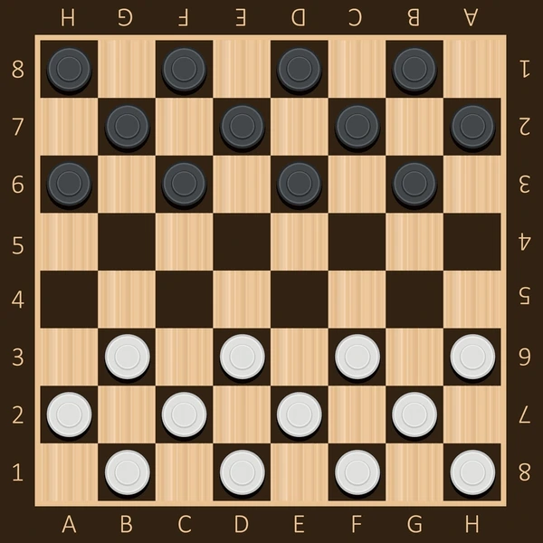

# Draughts

---

---

## Game 

Draughts is a strategy board game for two players which involve forward movements, it is played on an 8x8 checkerboard with 12 pieces each side, usually Black and white

The pieces move and capture diagonally forward, until they reach the opposite end of the board, when they come here they are crowned as king and can thereafter move and capture both backward and forward.

---

## Rules

### Starting position

Each player starts with 12 pieces on their side, with 3 rows of black and 3 rows of white pieces. The player with the black piece moves first, then turns alternate.

---

### Move Rules

There are two different types of moves:

1. Simple Move: It consists of a piece moving diagonally to an unoccupied dark square.
2. Jump Move: A jump consists of moving a piece that is diagonally adjacent an opponent's piece, to an empty square immediately beyond it in the same direction (thus "jumping over" the opponent's piece front and back ). Men can jump diagonally forward only; kings can jump in any diagonal direction. A jumped piece is considered "captured" and removed from the game. Any piece, king or man, can jump a king.

Multiple jumps are possible, if after one jump, another piece is immediately eligible to be jumped by the moved piece—even if that jump is in a different diagonal direction. If more than one multi-jump is available, the player can choose which piece to jump with, and which sequence of jumps to make. The sequence chosen is not required to be the one that maximizes the number of jumps in the turn; however, a player must make all available jumps in the sequence chosen. 

---

### Kings

If a piece moves into the king's row on the opponent's side of the board, it is crowned as a king and gains the ability to move forward and backward.

---

### End of the game

A player wins by capturing all of the opponent's pieces or by leaving the opponent with no legal move. The game is a draw if neither side can force a win, or by agreement (one side offering a draw, the other accepting). 

---

# Game Implementation

The game has been implemented in python, along with minimax algorithm for AI actions.

It has been divided into two modules namely Draughts and Algorithms check Modules for more information.

---