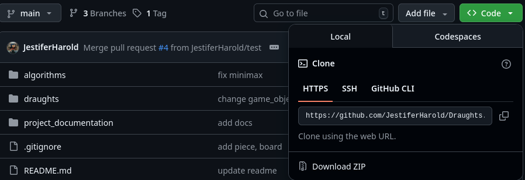
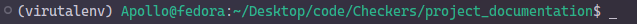

# Cloning the project

The draughts project can be found in this <a href = "https://github.com/JestiferHarold/Draughts">reposititory</a>

If you have git cli installed locally then copy paste this 

```bash
git clone https://github.com/JestiferHarold/Draughts
```

---

If not download the zip file from the code tab  



after downloading extract the zip file to your desired destination.

---

# Setting up the python virtual enviorment

> [!Warning] 
> Skipping this step to directly install the packages will lead to conflicts with global packages, proceed with your caution.

Now it's time to setup a virtual enviroment so that the packages we need to install here will not affect the global packages.

First check if python has been downloaded

```bash
python --version
```

If the output shows anything other than the following

```
Python 3.13.7
```

download and install python locally

>[!NOTE] 
>If only the version is different then skip the downloading python.

Go into the Project directory

```bash
cd draughts (or) <any other directory name>
```

after going into the project directory enter this

```bash
python -m venv virutal_env (or) <any_other_name>
```

If you are using linux based distro or macos type this command

```bash
source <name_of_the_venv>/bin/activate
```

If you are using windows enter 

```bash
.\<name_of_the_venv>\\Scripts\\activate.bat
```

If you get the name of the directory which hold the virutal enviroment like the picture below then HOORAYYY you have successfully activated the virtual enviroment.



If not try doing these steps again.

---

# Downloading the required packages

After activating the virtual enviroment, you need to install dependencies.

To do that just enter the following command

```bash
pip install -r dependencies.txt
```

> [!NOTE]
> The command is same for linux, macos and windows

This downloads all the dependencies/packages required to run the project.

---

# Running the game

Now the final and important step is to run the main.py, it is as simple as it sounds.

Just enter this in your command promt (or) terminal.

```bash
python main.py
```

HOORAYY the project is now running with no issues.

---

# To configure the documentation

The documentation is made using <a href = "https://www.mkdocs.org/" target = "_blank">mkdocs</a> which uses markdown to create webpages. This can be tinkered.

You are free to change the documentation and create a pull request notifing the changes and the reason for those changes.

---